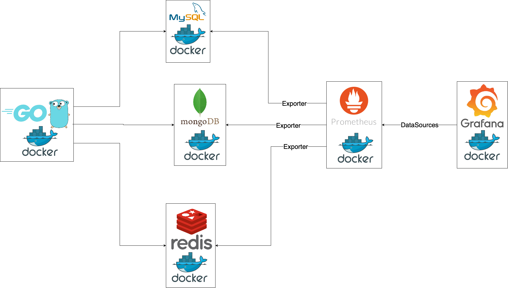

# koronet technical test

## Web Server
The web server is built with Go using the Gin framework and is designed to connect to a relational database (MySQL), a non-relational database (MongoDB), and Redis for caching.

### Docker
1. **Docker Image**: A minimal base image is used, optimized for size and build time with Alpine images. There are two Dockerfiles in the project: one is used with Docker Compose, compiling the application before deploying it in an Alpine image, and the other is specifically for deployment to Docker Hub, which utilizes only the Alpine image.
2. **Docker Compose**: The docker-compose.yml file runs the web server along with a relational database (MySQL), a non-relational database (MongoDB), and a Redis service. Each service is configured to operate on separate networks, isolating the nodes from one another. 

## Jenkins
The Jenkins pipeline begins by configuring the environment and compiling the application. After that, the Docker image is built, and security tests are conducted using Docker Scout to check for known vulnerabilities (CVE). If no vulnerabilities are found, the tagged image is deployed to Docker Hub. Following the deployment to Docker Hub, AWS credentials are configured, the context of the EKS cluster is set up, and the deployment is updated on the EKS cluster.

### Plugins
- Credentials Binding plugin
- Docker plugin
- Go plugin
- Git
- Pipeline 
- Workspace Cleanup Plugin

## Monitoring
To monitor the web server and Redis services, a diagram has been created to illustrate the high-level monitoring setup using Prometheus and Grafana. This setup involves using Prometheus to monitor MySQL, MongoDB, and Redis services through exporters that expose data in the appropriate format. Finally, Prometheus will be configured as a data source in Grafana to present the desired information in dashboards for visualization.

### Monitoring Tools
- **Prometheus**: Collects metrics from  Redis, MySQL and MongoDB.
- **Grafana**: Visualizes metrics from Prometheus.

## Terraform
The Terraform configuration sets up a Kubernetes cluster on AWS (EKS) and incorporates essential components such as a Virtual Private Cloud (VPC), subnets, and security groups.The setup includes public and private subnets, an Internet Gateway for external access, and a NAT Gateway to allow private subnet resources to communicate with the internet without exposing them directly.